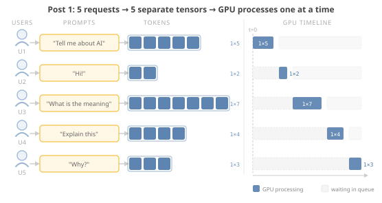
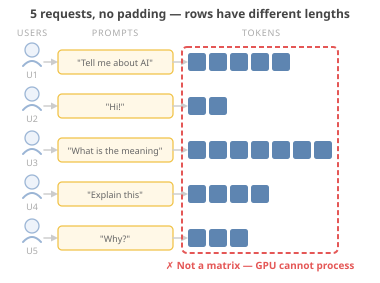
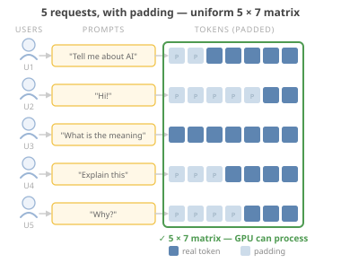
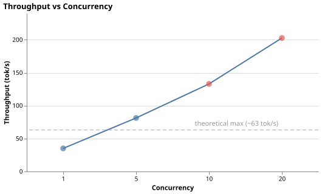
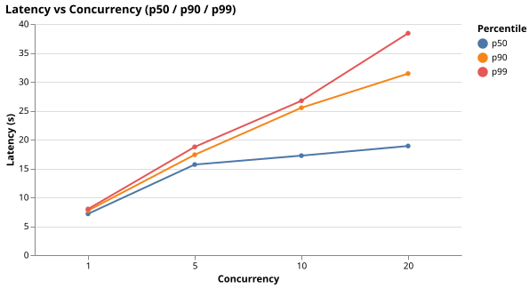
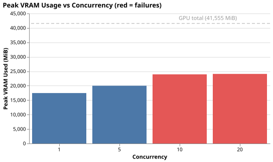

# Why your GPU is bored: batching, KV cache, and the memory wall

> Post 2 of *Self-Hosting Intelligence*. Code: branch [`02-batching`](../).

---

## Introduction

Post 1 ended with a result that should feel familiar to anyone who has debugged a queue with one consumer and many producers.

The server had a thread pool. Multiple requests were in-flight at the HTTP layer. The GPU was busy 67–72% of the time. And yet throughput was flat — 36–37 tok/s regardless of whether 1 or 10 users were sending requests simultaneously. Every additional user just extended the queue. Latency scaled linearly with concurrency, just as it does when you add producers to a single-threaded worker.

The GPU is the consumer. Users are the producers. And like any queue with one consumer, the path to higher throughput is not more producers — it is making the consumer process more work per cycle.

In message queue systems, the standard answer to this is batching: instead of sending N individual messages to the downstream worker, accumulate them and send one message containing all N. The worker processes a batch in roughly the same time it would process a single item, and throughput climbs.

The same idea applies here. Instead of calling `model.generate()` for each request individually, we collect several requests and run them through the model together in a single forward pass. The GPU processes multiple sequences simultaneously, amortizing the per-request overhead across the batch.

This is **static batching**. It works — throughput improves significantly. And like batching in queues, it introduces its own failure mode.

---

## How GPU batching works

Before looking at the implementation, it is worth understanding what batching actually means at the GPU level — because it is not just "process more requests at once."

### Post 1: one sequence at a time

In Post 1, each request was handled independently. The model received a single sequence of tokens — the tokenized prompt — and produced a single output sequence, one token at a time.

From the GPU's perspective, this looked like:


One user, one prompt, one row of tokens, one tensor. The GPU ran a forward pass over that single row and produced the next token. Repeat until generation finishes.

The GPU is designed to execute thousands of small operations in parallel — but all that parallelism was applied to the elements *within* a single sequence. The sequence itself was processed alone.

When five users sent requests simultaneously in Post 1, nothing changed structurally. Five separate 1×N tensors were created — one per request — and the GPU processed them one after the other, with small idle gaps between each forward pass:



Users 2 through 5 waited in the queue while each preceding request ran to completion. That is why latency scaled linearly with concurrency — each user waited for every user ahead of them.

The thread pool in Post 1 was a CPU-world solution applied without adjustment. The assumption behind it: more concurrent threads means more work done simultaneously. That holds on a CPU because the OS scheduler multiplexes threads across cores, and each core can independently chase its own instruction stream.

The GPU has no equivalent scheduler. Each forward pass acquires the hardware exclusively and holds it until the operation finishes. Threads in the pool did not run in parallel on the GPU — they queued in front of it. The result looked exactly like a single-consumer queue: throughput flat regardless of producer count, latency growing linearly with concurrency. The OS gave the illusion of parallelism at the HTTP layer; the GPU refused to participate in that illusion.

### Batching: multiple sequences in one forward pass

The key insight is that a GPU forward pass does not have to process one sequence. It can process a **matrix** — multiple sequences stacked as rows — in exactly the same time it would process a single row. The GPU's tensor cores perform matrix multiplication across all rows simultaneously. One forward pass, multiple outputs.

This is what batching gives us. Instead of:

```
request_1 → generate() → response_1
request_2 → generate() → response_2   (waits for request_1 to finish)
```

We get:

```
[request_1, request_2, request_3] → generate() → [response_1, response_2, response_3]
```

Same GPU time, three responses.

### The problem: sequences have different lengths

Prompts are not the same length. One user sends two words. Another sends two paragraphs. When you try to stack these as rows of a matrix, the rows have different numbers of columns — they do not form a rectangle.

A GPU matrix operation requires a rectangle. Every row must be the same length.



This is not a GPU limitation specifically — it is a fundamental requirement of matrix multiplication. You cannot multiply a jagged array. The batching idea only works if we can form a proper matrix.

### The fix: left-padding

The solution is to extend shorter sequences with a special padding token until all rows are the same length — the length of the longest sequence in the batch.

The padding must go on the **left**. The model generates new tokens by appending them to the right end of the sequence. If you pad on the right, real tokens end in the middle and generation would continue into the padding. Left-padding keeps all real tokens flush against the right edge, so every sequence in the batch ends at the same position and generation starts from there.

An attention mask tells the model which positions are real and which are padding — so the padding tokens do not influence the output. They take up space and consume compute, but the generated text is unaffected.



Now all five rows are the same length. The GPU receives a proper 5×7 matrix, runs one forward pass, and produces five output tokens simultaneously — one per sequence.

This is how static batching works. The cost — those grey padding tokens on the left — is the first thing we will come back to in the problems section.

---

## Implementation

### Static batching with timeout

The Post 1 server handed each request directly to a thread pool. Adding static batching means inserting a collection step: incoming requests go onto a queue and wait, a background thread accumulates them into a batch, then fires a single `model.generate()` call and distributes the results back.

Two parameters control this:

- **`BATCH_SIZE`** — the maximum number of requests in one batch
- **`BATCH_TIMEOUT_MS`** — how long to wait for a full batch before firing anyway

The timeout is necessary. Under low load the queue may never reach `BATCH_SIZE`. Without it, the batching thread would stall waiting for requests that never arrive. With it, the thread fires with whatever has accumulated — even a single request — so latency stays bounded.

```python
def _collect_batch() -> list[_BatchItem]:
    timeout_s = BATCH_TIMEOUT_MS / 1000.0
    deadline = None
    batch = []

    while len(batch) < BATCH_SIZE:
        if deadline is None:
            item = _request_queue.get()   # block until first item arrives
            batch.append(item)
            deadline = time.perf_counter() + timeout_s
        else:
            remaining = deadline - time.perf_counter()
            if remaining <= 0:
                break
            try:
                item = _request_queue.get(timeout=remaining)
                batch.append(item)
            except queue.Empty:
                break

    return batch
```

The loop blocks on the first item — no busy-waiting. The timeout clock only starts once that first request arrives, so a quiet server doesn't spin.

The HTTP layer (FastAPI) is async; the batching loop runs in a background thread. The bridge between them is a `concurrent.futures.Future`: each request creates one and parks it on the queue. The batching thread resolves each future with the result. The async endpoint awaits via `run_in_executor`, which blocks only the executor thread — not the event loop — so the server keeps accepting new requests while the batch runs.

### Padding and attention masks

Once a batch is collected, the prompts are different lengths. To pass them to the model as a single matrix, shorter sequences need padding tokens prepended until all rows are the same width. The tokenizer handles this in one call:

```python
tokenizer.padding_side = "left"
inputs = tokenizer(
    texts,
    return_tensors="pt",
    padding=True,
).to(input_device)
```

`padding=True` pads all sequences to the length of the longest. `padding_side = "left"` is the critical setting — padding must go on the left so real tokens stay flush against the right edge, where generation appends new tokens. Padding on the right would mean sequences end in the middle and generation continues into garbage positions.

The tokenizer returns two tensors:

- **`input_ids`** — the token IDs, with the padding token ID filling empty positions
- **`attention_mask`** — a 0/1 matrix of the same shape: `1` for real tokens, `0` for padding

The attention mask is what keeps padding from contaminating the output. Inside each transformer layer, attention scores are computed for every position. Before the softmax, any position where the mask is `0` gets its score set to `-inf` — which softmax turns into exactly zero weight. Padding positions attend to nothing and nothing attends to them. The model is arithmetically blind to them.

This is only necessary for padding. Cross-user isolation — User 1's tokens not influencing User 5's output — comes from something simpler: attention is computed independently per row of the batch. There is no operation in a standard transformer that mixes rows together. The mask does not need to do that work; the structure of the computation already makes it impossible.

Both tensors move to GPU together. `model.generate(**inputs)` unpacks them and the mask is applied automatically at every attention layer throughout generation. No further configuration needed.

The full implementation is in `src/server.py` on the `02-batching` branch — around 220 lines.

---

## Results

Same setup as Post 1: RTX 4090, Llama 3.1 8B Instruct in bf16, 200 ShareGPT prompts, max 256 output tokens, concurrency levels 1 / 5 / 10 / 20. Default batch size: 8, batch timeout: 100ms.





| Concurrency | Throughput (tok/s) | vs Post 1 | p50 latency | p99 latency | Failed |
|-------------|-------------------|-----------|-------------|-------------|--------|
| 1 | 35.1 | ~same | 7.1s | 8.0s | 0/200 |
| 5 | 81.3 | **+2.2×** | 15.7s | 18.7s | 0/200 |
| 10 | 133.0 | **+3.6×** | 17.2s | 26.7s | 8/200 |
| 20 | 202.6 | **+5.5×** | 18.9s | 38.4s | **90/200** |

Batching works. Throughput at concurrency 5 is more than double Post 1. At concurrency 20 it is 5.5× — 202 tok/s versus 37.

Latency also improved. At concurrency 20 in Post 1, p50 was 115 seconds. Here it is 19 seconds — the queue drains faster because the GPU processes 8 requests per batch instead of 1.

Concurrency 1 is nearly identical to Post 1. Under low concurrency, the batch timeout fires with a single request — batching adds no value when there is nothing to batch.

Two problems are visible in the numbers: failures start at concurrency 10 and reach 45% at concurrency 20. Those are not timeouts — they are the server returning errors. The GPU ran out of memory.

---

## Problems

### Memory wall

The throughput improvement came at a cost. The KV cache — the data structure that makes generation efficient — now has to exist for every sequence in the batch simultaneously.

To understand why this matters, it helps to know what the KV cache is and where it comes from.

When the model generates each new token, it computes **attention** over the entire sequence so far — every previous token influences what comes next. Attention involves computing key and value vectors for each token in the context. Without caching, these are recomputed from scratch at every generation step. With the KV cache, they are computed once and stored. Each new token only needs to compute its own key and value vectors and attend to the cached ones from previous steps.

This turns generation from an O(n²) operation (recompute everything for every token) into O(n) (compute once, read from cache). For a single request, the memory cost is:

```
KV cache size ≈ 2 × num_layers × num_heads × head_dim × sequence_length × bytes_per_element
```

For Llama 3.1 8B in bf16, this works out to roughly 0.5 MB per token in the sequence. A 500-token sequence uses about 250 MB of KV cache. Manageable for one request.

With a batch of 8 requests, each potentially hundreds of tokens long, the total KV cache is 8× that. And it must all fit in VRAM alongside the 15.7 GB of model weights.

The RTX 4090 has 24 GB of VRAM. After loading model weights, roughly 8 GB remains. At batch size 8 with longer sequences, that headroom fills up.



| Concurrency | Peak VRAM used | Free VRAM | Failures |
|-------------|---------------|-----------|---------|
| 1 | 71% | 7.1 GB | 0 |
| 5 | 81% | 4.6 GB | 0 |
| 10 | 97% | 0.6 GB | 8 |
| 20 | 98% | 0.5 GB | 90 |

At concurrency 10, the GPU is nearly full. At concurrency 20, PyTorch throws `torch.OutOfMemoryError: CUDA out of memory` mid-batch — and the affected requests fail.

Note that VRAM did not drop back to baseline after the benchmark finished. PyTorch's GPU allocator does not release reserved memory back to the driver when tensors are freed — it holds it in a pool for future allocations. This is the same design as `malloc`/`free` in C: `free()` does not return memory to the OS, it returns it to the allocator's internal pool. On CPU, the OS has mechanisms to reclaim this eventually. On GPU, it stays reserved for the lifetime of the process. The only way to release it is `torch.cuda.empty_cache()` — or restart the server.

### Padding waste

Every sequence in a batch is padded to the length of the longest one. If one request has a 20-token prompt and another has a 500-token prompt, the 20-token request gets 480 padding tokens prepended. The model runs attention over those padding positions anyway — the attention mask prevents them from contributing to the output, but the compute cycles are still consumed.

In the worst case — a batch where one request is much longer than the others — most of the GPU's work is padding arithmetic. The effective throughput for the short requests is terrible even though the raw tok/s number looks fine.

This is hard to measure without a GPU profiler (nsight or similar). The waste is real but not visible in the telemetry we have. It shows up indirectly in lower-than-expected throughput on workloads with high variance in prompt length.

### Head-of-line blocking

In a message queue, when you batch N messages together, the downstream worker finishes the entire batch before acknowledging any of them. A short message that happens to land in the same batch as a long one waits for the long one to finish before it can be returned to the sender.

The same thing happens here. `model.generate()` returns when the longest sequence in the batch has finished — all sequences generate tokens in lockstep. Short sequences reach their end, but they cannot be returned until the longest one is done.

To see this, consider a batch with one 500-token request and seven 50-token requests. The seven short requests finish in roughly 1/10th the time, but they sit idle — KV caches allocated, memory occupied, results ready — waiting for the long one. Their p99 latency is determined by the longest request in their batch, not by their own length.

This becomes visible in a workload that deliberately mixes short and long requests — which is the next benchmark.

---

## Benchmark: demonstrating the problems

*TODO: mixed workload benchmark results and HOL blocking charts go here.*

---

## What's next

Static batching is the right instinct applied to the wrong abstraction. Collecting multiple requests and processing them together is correct. Treating the batch as an atomic unit — allocating all KV caches upfront, waiting for the longest sequence before returning any result — is what creates the problems.

The memory wall comes from pre-allocating contiguous KV cache blocks per sequence. PagedAttention, the key innovation in vLLM, breaks KV cache into fixed-size pages that can be allocated non-contiguously — the same idea as virtual memory in an OS. No over-allocation, no fragmentation.

The HOL blocking comes from running all sequences in a batch to completion before returning any of them. Continuous batching, the scheduling algorithm vLLM uses, swaps finished sequences out of the batch immediately and replaces them with new ones. Short requests are returned as soon as they finish, not when the longest one in their batch does.

Post 3 drops in vLLM, reads its scheduler and block manager source, and shows what both of these look like in practice.

*→ Post 3: Continuous batching and PagedAttention: how vLLM actually works*
